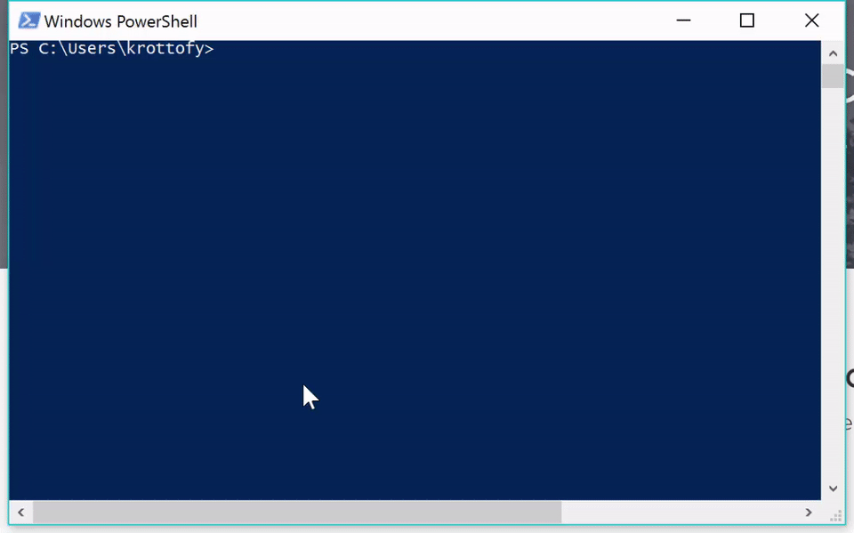
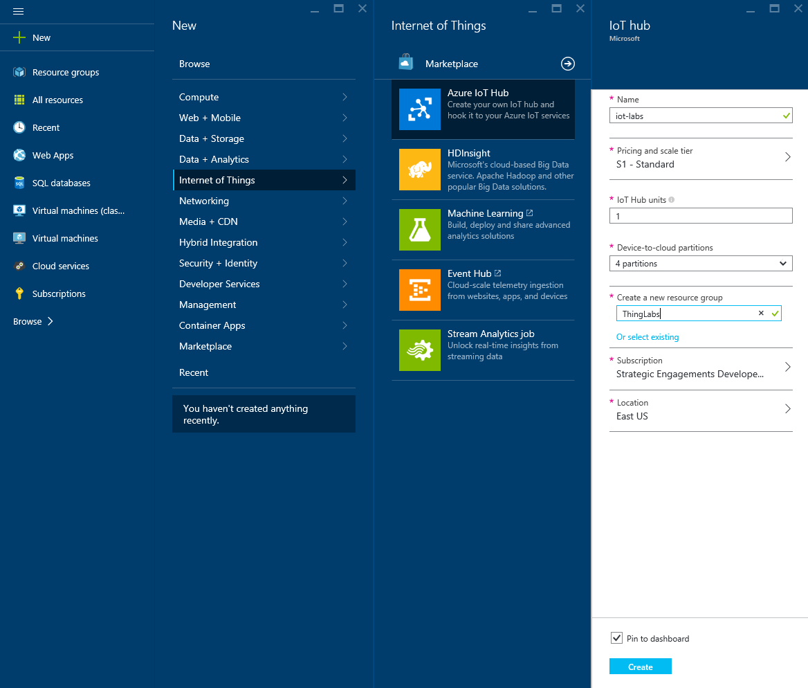
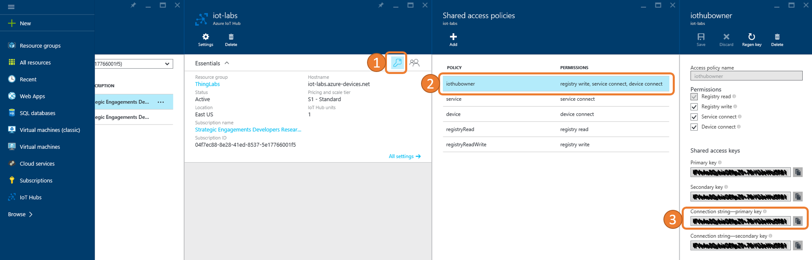
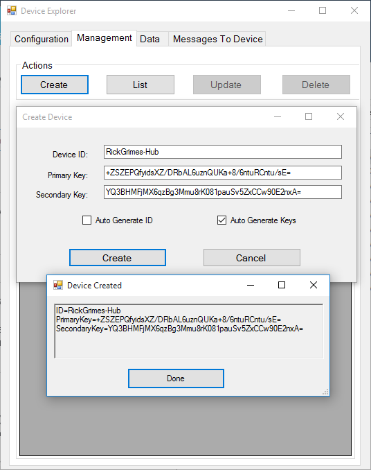
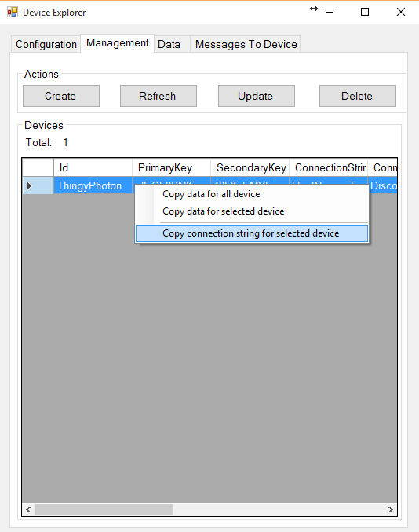
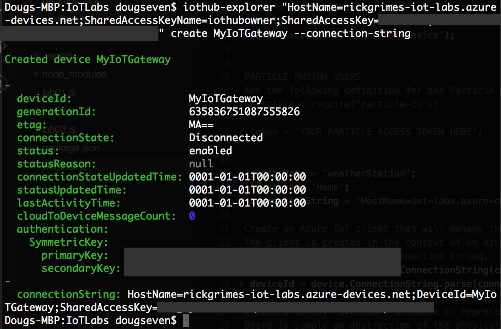
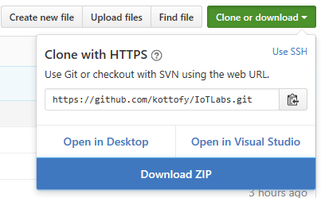

# Photon Weather Station Quick Lab
This is a spinoff of the lab at [ThingLabs.io](http://www.thinglabs.io) condensed into a faster version.

## Setup
### Install a Code Editor
If you don’t already have one installed, pick a text/code editor. Feel free to use anything you like, provided it won’t inject any extra text into your files.  
Some Options:
- Visual Studio Code (preferred tool)
- Visual Studio
- Sublime Text
- Eclipse
- Notepad++

### Install Node.js
Install the latest Long-Term Support (LTS) relase from [nodejs.org](http://nodejs.org).

### Set Up a Development Directory
On Windows, open up Powershell.

Prepare a place to save all of your work in the labs. We recommend an easy to navigate to directory with a relatively short path. Create a new folder/directory for the labs:  

#### Windows:
```
C:\Development\IoTLabs
```
#### Mac OS X:
```
~/Development/IoTLabs
```

### Create a Microsoft Azure Trial Account
You will use Microsoft Azure as the cloud backend for your IoT solution. If your instructor has provided you an Azure pass, please go [here](http://microsoftazurepass.com) to redeem. If you don’t already have an Azure account, go to https://azure.microsoft.com/en-us/pricing/free-trial/ to start a free trial of Microsoft Azure. You may need a credit card for identity verification but the trial is completely free. If you have an MSDN Subscription you may be eligible for free credits to Microsoft Azure every month. Check your MSDN account page for details.

## Setup Photon Board
If your instructor does not provide a Particle Access Token or Device ID, please go [here](http://thinglabs.io/workshop/js/weather/setup-photon/) to see how to claim your Photon Board and get this information. 

### Install Particle-CLI
The Particle-CLI is a command line interface for working with both the Particle Photon and the Particle Cloud. This tool will be used to ‘claim’ or provision your Photon, and may provide other useful benefits.

#### On Windows in Powershell:
```
npm install -g particle-cli
```
#### On Mac OS X in Terminal: 
```
npm install -g particle-cli
```

### Connect to Wifi
Enter the following to connect the Photon to your Wi-Fi network and follow the prompted instructions:  
```
particle serial Wifi
```

View the following video for reference.  


## Setting Up Azure IoT Hub
### Setup an Azure IoT Hub
In a browser, navigate to the Azure Portal at http://portal.azure.com and login. Once logged in:
1. Click on the New menu option in the upper-left
2. Select Internet of Things
3. Select Azure IoT Hub
4. Give it a name such as your name followed by ‘IotLabs’ (i.e. rickGrimesIotLabs)
5. Select the pricing tier (the free F1 tier works as well for this lab)
6. Select or create a new Resource Group
7. Select a location (choose the one closest to your physical location)  


Once the IoT Hub is created, navigate into it and:
1. Click on the key icon at the top of the blade
2. In the next blade, click on the iothubowner entry
3. Copy the Connection string-primary key to your clipboard  


### (On Windows) Use the Azure IoT Hub DeviceExplorer
Azure IoT Hub only allows connections from known devices that present proper credentials. In this lab series you will use either the DeviceExplorer utility or the iothub-explorer command line interface to provision a device for use in Azure IoT Hub. While Azure IoT Hub supports multiple authentication schemes, you will use pre-shared keys in this lab series.  
The simplest way to provision a new device is with the DeviceExplorer utility (Windows only). If you are using Windows, download and run Device Explorer. After running the installed, the DeviceExplorer.exe can be found at C:\Program Files (x86)\Microsoft\DeviceExplorer. When you run the utility you need to input the iothubowner connection strong (from the previous step) in the IoT Hub Connection String field found in the Configuration tab.  
![Alt text([Images/deviceexplorer01.png "DeviceExplorer")

### Create a New Azure IoT Device
If you are using the DeviceExplorer simply open the Management tab and click the Create button. In the dialog that opens, enter the name of your device - something like MyIoTGateway works well. Then Click the Create button, and click Done on the confirmation dialog that opens.    


You will see your device in the Devices list. Once a device is created, you can get the device-specific connection string by selecting it in the Devices list, right-clicking and selecting Copy connection string for selected device:


### (On Any Platform) Use the iothub-explorer CLI  
If you are on a non-Windows machine, or prefer to use a command line interface instead of the DeviceExplorer utility, you can install the iothub-explorer command line interface. The iothub-explorer tool enables you to provision, monitor, and delete devices in your IoT hub. It runs on any operating system where Node.js is available.

From a command line (Command Prompt on Windows, or Terminal on Mac OS X), execute the following:  
```
npm install -g iothub-explorer
```

### Create a New Azure IoT Device
If you are on a non-Windows machine, or prefer to use a command line interface instead of the DeviceExplorer utility, you can provision a new Azure IoT Hub device using the iothub-explorer command line interface.
In the same directory as before, using the Node.js command prompt or Terminal, execute the following command (you may need to wrap the connections string in quotes, depending on the command line application you are using).  
```
iothub-explorer "[YOUR IOT HUB CONNECTION STRING]" create Thingy --connection-string
```
Once a device is created, the device information, including the device-specific connection string will be displayed.  


The device-specific connection string identifies the device by name and includes a key that is only for that device. Copy the device connection string somewhere that you will be able to access it shortly.

## Sending Telemetry to the Cloud

### Setup the Code
Download the code as a ZIP on [GitHub](http://github,com/kottofy/IoTLabs) and extract this to the location of your project folder.


Open a terminal window (Mac OS X) or Node.js command prompt (Windows)
Execute the following commands (replace C:\Development\IoTLabs with the path that leads to your development directory):  
#### Windows:
```
cd C:\Development\IoTLabs  
npm install
```  
#### Mac OS X:
```
cd ~/Development/IoTLabs
npm install
```

### Update Code
1. Open up your IDE such as Visual Studio Code and navivate to the IoTLabs project folder.
2. Replace where it says `YOUR PARTICLE ACCESS TOKEN HERE` with the particle access token from Particle.
3. Replace where it says `GIVE A NAME TO THE LOCATION OF THE THING` with the location of the device (can be anything).
4. Replace where it says `YOUR IOT HUB DEVICE-SPECIFIC CONNECTION STRING HERE` with the connection string copied from the Device Explorer.
5. Replace where it says `YOUR PARTICLE PHOTON DEVICE ID OR ALIAS` with the Device ID from Particle.

## Run the App
Open a terminal window (Mac OS X) or command prompt (Windows)
Execute the following commands (replace c:\Development\IoTLabs with the path that leads to your labs folder):  
#### Windows:
```
cd C:\Development\IoTLabs
  node weather.js
```
#### Mac OS X:
```
 cd ~/Development/IoTLabs
  node weather.js
```

After the board initializes you will see messages printing out once per second. This is the message payload that is being sent to Azure IoT Hub.

### Monitor the Messages Being Received by Azure IoT Hub
#### DeviceExplorer:
1. Open the Data tab.
2. Select the device from the dropdown list.
3. Click Monitor to begin monitoring messages as they come into your Azure IoT Hub.

#### iothub-explorer:
From a command prompt execute the following command, replacing `[connection-string]` with your iothubowner connection string (from the previous lab) and `[device-id]` with the Azure IoT Hub id for this device.
```
iothub-explorer "[connection-string]" monitor-events [device-id]
```

**PARTICLE PHOTON USERS**: After stopping the application press the Reset button on the Photon to prepare it for the next run. 

## Visualize Data
If you would like to visualize the data with Power BI, please go [here](http://thinglabs.io/workshop/js/weather/visualize-iot-with-powerbi/), or if you would like to use a free Azure Web App, please go [here](http://thinglabs.io/workshop/js/weather/visualize-iot-with-web-app/).

Please note that you will need a School or Work Microsoft account in order to user Power BI.